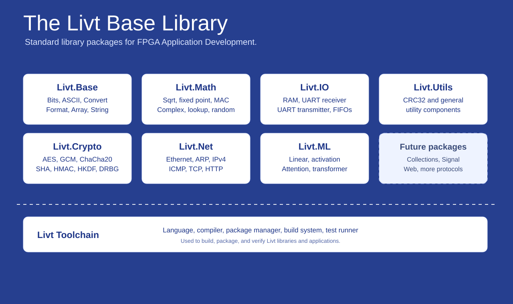

# Livt

`Livt` is the standard-library meta-package for Livt projects. It gives
applications and larger packages one dependency that brings in the official Livt
library packages as a tested, compatible set.

The 0.1.0 package is a manifest bundle only. It does not publish source
components of its own; it pins versions of the focused library packages that
make up the current Livt standard library.



## 📦 Package

```toml
[dependencies]
Livt = "0.1.0"
```

Use `Livt` when an application wants the full standard library surface. Smaller
reusable packages should usually depend only on the specific package they need,
such as `Livt.Math`, `Livt.IO`, or `Livt.Crypto`.

## 📚 Package Set

`Livt 0.1.0` pins this compatible package set:

| Package | Version | Role |
|---|---:|---|
| `Livt.Base` | `0.1.1` | Foundational helpers and common library components |
| `Livt.Math` | `0.3.0` | Numeric, fixed-point, arithmetic, lookup, and random helpers |
| `Livt.Net` | `0.24.1` | Ethernet, ARP, IPv4, ICMP, TCP, HTTP, and EthernetLite helpers |
| `Livt.Crypto` | `1.0.1` | Cryptographic primitives, hashes, MACs, KDFs, AEADs, and DRBGs |
| `Livt.ML` | `0.1.0` | Fixed-size ML building blocks and approximation/reference components |
| `Livt.IO` | `0.1.0` | RAM and UART I/O components |
| `Livt.Utils` | `0.1.0` | General-purpose utility components such as CRC32 |

The authoritative dependency pins live in [`livt.toml`](livt.toml). Keep the
table above aligned with that manifest when preparing a new meta-package release.

## 🔌 Dependency Policy

`Livt` is for consumers that want the whole standard library. It is intentionally
not a replacement for precise dependencies in small reusable libraries.

Good fits for depending on `Livt`:

- application packages
- board demos and integration projects
- examples that intentionally show multiple standard-library areas
- internal projects that prefer one coordinated upgrade point

Good fits for depending on focused packages directly:

- a math helper package that only needs `Livt.Math`
- a networking package that only needs `Livt.IO`
- a crypto wrapper that only needs `Livt.Crypto`
- a utility package that should stay dependency-light

## 🧪 Build and Test

`Livt` has no source components and no configured test components. Running
`livt test` in this repository syncs the pinned dependencies, then reports that
no local test VHDL was generated. Validate releases by checking that `livt.toml`
pins existing published package versions and by running the individual package
test suites before publishing the bundle.

Supporting notes live in [`docs/package-set.md`](docs/package-set.md) and
[`docs/usage.md`](docs/usage.md).

## 🛠️ Development Notes

- Keep `Livt` as a manifest-only package.
- Do not add source components to this repository.
- Add new standard-library packages here only after they are publish-ready on
  their own.
- Update `livt.toml`, the README package table, and `docs/package-set.md`
  together.
- Use focused package dependencies for reusable libraries unless the full bundle
  is genuinely intended.

## 🚧 Outlook

Future `Livt` releases should track stable combinations of the standard library
packages. The meta-package version can move independently from the individual
package versions whenever the compatible bundle changes.

## 📄 License

This project is licensed under the MIT License. See [LICENSE](LICENSE).
